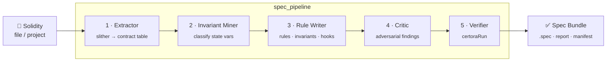

<div align="center">


<br/>

**Turn a Solidity file or project into a CVL specification that has actually been run through the Certora Prover — with an honest verdict for every rule.**

<br/>

[](pyproject.toml)
[](https://docs.certora.com/)
[](https://github.com/crytic/slither)
[](pyproject.toml)
[](LICENSE)

</div>

---

## Why Auto-Spec

Writing formal specifications is slow, expert work. Auto-Spec drafts the spec for you and then **proves it** — a spec is never presented as verified unless a prover verdict exists for **every** rule it contains. When verification cannot complete, the run stops with exactly one classified outcome that names the blocking cause, so you always know why.

| | |
|---|---|
| **Honest by construction** | No rule is called "verified" without a real `certoraRun` verdict behind it. |
| **One outcome per run** | Every run ends in exactly one classified [outcome](#-outcomes-and-exit-codes) with a matching exit code. |
| **Deterministic where it counts** | The `methods` block is generated from a static analysis table, not guessed. |
| **Self-repairing** | The optional Repair Loop re-prompts using real prover diagnostics. |
| **Reproducible** | Record/replay LLM cache enables byte-identical reruns; secrets are always redacted. |

---

## 🔭 The pipeline at a glance



Each stage writes a typed artifact (`<base>_stageN.json`) that later stages read. The user-facing deliverable — the **Spec Bundle** — is the final `.spec` file, the Verification Report, and the Run Manifest.

<details>
<summary><b>What each stage does</b></summary>

1. **Stage 1 — Extractor.** Runs slither to produce the first-party contract table: contracts, state variables, function gates, and caller edges.
2. **Stage 2 — Invariant Miner.** Classifies each state variable into one invariant category (LLM-driven).
3. **Stage 3 — Rule Writer.** Produces CVL rules, invariants, hooks, and ghost declarations. Emits the deterministic `methods` block from the Stage 1 table and extracts CVL non-destructively. An iterative variant (Repair Loop) re-prompts using prover diagnostics.
4. **Stage 4 — Critic.** Produces adversarial sibling-function findings and folds them into the spec.
5. **Stage 5 — Verifier.** Invokes `certoraRun` with the remappings and solc the project needs, and produces the Verification Report with a single Verification Status.

</details>

---

## 🚀 Quick start

Supported Python: **>=3.10, <3.15** (declared in [`pyproject.toml`](pyproject.toml)).

```bash
# 1. Create a clean virtual environment
python -m venv .venv
source .venv/bin/activate

# 2. Bootstrap — installs pinned deps and prints resolved tool versions
scripts/bootstrap.sh

# 3. Generate and verify a spec
python -m spec_pipeline path/to/Contract.sol
```

Prefer pip directly?

```bash
pip install -e .          # runtime dependencies
pip install -e '.[test]'  # runtime + test dependencies
```

Dependencies (pinned in `pyproject.toml`):

- **Runtime:** `slither-analyzer`, `networkx`, `openai`, `pdfplumber`
- **Test:** `pytest`, `pytest-cov`, `hypothesis`

---

## 🛠️ Usage

### Core pipeline

```bash
python -m spec_pipeline <path> \
  [--stages 1 2 3 4 5] \
  [--stage N] \
  [--output-dir DIR] \
  [--certora-args "..."] \
  [--iterative-stage3] \
  [--max-iterations N]
```

| Flag | Description |
|---|---|
| `<path>` | A Solidity file or a project directory to analyze. |
| `--stages` | The set of stages to run (default: all five). |
| `--stage N` | Run a single stage. |
| `--output-dir DIR` | Where artifacts and the Spec Bundle are written. |
| `--certora-args "..."` | Extra arguments passed through to `certoraRun`. |
| `--iterative-stage3` | Use the Repair Loop variant of Stage 3. |
| `--max-iterations N` | Repair Loop iteration cap (default 3, range 1–10). |

Additional flags that add capability while preserving prior default behavior:

| Flag | Description |
|---|---|
| `--no-cache` | Run every requested stage from its inputs; do not read artifacts already on disk. |
| `--require-cache` | Exit with code 3 and name the missing or stale artifact when a prerequisite is absent or stale. |
| `--allow-missing-tools` | Run stages whose tools resolved; record `skipped_missing_tool` for the rest. |
| `--deps-root PATH` | Additional shared Solidity dependency root(s) to search (repeatable). |
| `--verify-contract NAME` | When Stage 1 declares more than one first-party contract, verify the named contract(s). |
| `--autofix-cvl` | Apply only the semantics-preserving rewrites in the CVL autofix allowlist and record each one. |

### Evaluation harness

Scores the pipeline against the human-written pairs in `Paired_Dataset` and records a baseline used by the quality gate.

```bash
python -m spec_pipeline.evaluation [--jobs N] [--resume] [--update-baseline]
```

- `--jobs N` — run up to N pipeline invocations concurrently (default 1).
- `--resume` — skip pairs that already have a complete record for the current source fingerprint.
- `--update-baseline` — overwrite the evaluation baseline only when every floor and tolerance check passes.

### Hygiene check

Reports version-control hygiene violations (tracked paths matching ignore rules, tracked compiled Python artifacts). Exits 0 when clean, 1 otherwise.

```bash
python -m spec_pipeline.hygiene_check
```

---

## 🧰 External tools

The pipeline invokes these external tools. Each is required only by the stages listed. Minimum versions are the lowest known-good versions for this pipeline; `scripts/bootstrap.sh` prints the versions actually resolved on your machine.

| Tool | Required by | Min version | Install |
|---|---|---|---|
| `solc` (via slither) | Stage 1, Stage 5 | 0.5.0 | `pip install solc-select` → `solc-select install <ver> && solc-select use <ver>` |
| `certoraRun` | Stage 5 | 7.0.0 | `pip install certora-cli` |
| `node` + `npm` | Stage 5 (Hardhat/npm imports) | node 18, npm 9 | `nvm install 18` (or nodejs.org) |
| GitHub CLI (`gh`) | Dataset scraping (off the run path) | 2.0.0 | `brew install gh` / `sudo apt install gh` |

> slither itself is installed as the pinned `slither-analyzer` Python dependency by `scripts/bootstrap.sh`.

---

## 🔑 Environment variables

| Variable | Default | Effect |
|---|---|---|
| `LLM_BASE_URL` | provider default | Base URL of the LLM endpoint used by stages 2–4. |
| `LLM_MODEL` | none | Model name requested from the provider; recorded in the Run Manifest. |
| `LLM_API_KEY` | none | API key for the LLM provider. Redacted (written as `REDACTED`) in every artifact and log. |
| `LLM_MAX_TOKENS` | provider default | Maximum completion tokens requested per LLM call. |
| `LLM_CACHE_DIR` | unset (disabled) | Directory for the record/replay cache. Responses are keyed on the SHA-256 of system prompt, user prompt, model, and temperature, enabling byte-identical replays. |
| `SOLIDITY_DEPS_ROOT` | unset | Additional shared Solidity dependency root(s) searched by the Dependency Resolver. |
| `CERTORA_DATASET_ROOT` | inferred repo root | Base directory the scraper and evaluation harness treat as the `Paired_Dataset` root. |

> 🔒 Any environment variable whose name ends with `_API_KEY`, `_TOKEN`, or `_SECRET` has its value redacted in all artifacts and logs.

---

## 🚦 Outcomes and exit codes

Every run terminates with exactly one member of the Outcome Set. The CLI exits with code `0` only when the status is `verified` or `verified_with_warnings`, and with a distinct documented nonzero code for every other outcome.

| Outcome | Exit | Meaning | How to resolve |
|---|:--:|---|---|
| ✅ `verified` | 0 | every rule passing, non-vacuous, no warnings | None — ship the Spec Bundle. |
| ✅ `verified_with_warnings` | 0 | all passing, no vacuity, ≥1 prover warning | Review the warnings; address them if they affect intent. |
| ❌ `violated` | 1 | ≥1 rule failing | Inspect the failing rule's counterexample; fix the contract or the rule. |
| ⚠️ `vacuous` | 2 | all passing but ≥1 vacuous rule | Strengthen preconditions so each named rule's premises are reachable. |
| 🚫 `no_first_party_contracts` | 4 | zero first-party contracts | Point `<path>` at your own sources; check dependency roots didn't filter them out. |
| 🔧 `tool_unavailable` | 5 | a required tool is absent | Install the named tool, or rerun with `--allow-missing-tools`. |
| 🧩 `typecheck_failed` | 6 | CVL typechecker rejected the spec | Read the diagnostics; rerun with `--iterative-stage3` (and optionally `--autofix-cvl`). |
| 🧱 `compile_failed` | 7 | slither/solc could not compile | Supply the correct `--deps-root`/remappings and a solc matching the pragmas. |
| 📦 `no_compatible_solc` | 8 | no installed solc satisfies pragmas | `solc-select install <ver>` for a satisfying version. |
| 🔀 `unsupported_pragma_set` | 9 | first-party files declare disjoint pragmas | Reconcile the conflicting pragmas, or analyze the files separately. |
| 🌐 `llm_unavailable` | 10 | LLM endpoint rejected the probe | Verify `LLM_BASE_URL`, `LLM_MODEL`, `LLM_API_KEY`, and network access. |
| ⏭️ `skipped_missing_tool` | 0 | stage skipped under `--allow-missing-tools` | Install the named tool and rerun without the flag. |
| ⏱️ `timeout` | 11 | prover/run budget elapsed | Narrow scope (`--verify-contract`), simplify rules, or raise the budget. |
| 💥 `error` | 12 | unhandled/other | Read the captured traceback and file the failure; rerun after addressing the cause. |

---

## 📁 Repository layout

```
spec_pipeline/     Five-stage pipeline (extract · invariants · rules · critic · verify)
solidity_graph/    Slither-based static analyzer producing the contract table
Paired_Dataset/    Human-written contract + spec pairs used for evaluation
scripts/           Bootstrap, coverage gate, hygiene check
docs/              How it works, assets
tests/             Unit, property, and integration suites
```

---

## 🤝 Contributing

Issues and pull requests are welcome. Before opening a PR, run the test suite and the hygiene check:

```bash
pip install -e '.[test]'
pytest
python -m spec_pipeline.hygiene_check
```

---

## 📄 License

Released under the [MIT License](LICENSE).
